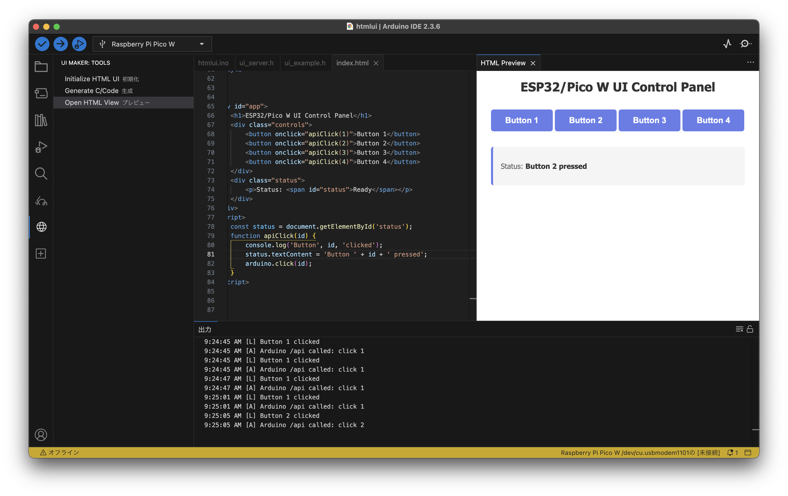

# UI Maker Extension for Arduino IDE

Arduino IDE用のESP32/Pico W向けHTML UI開発支援拡張機能です。WebUIの開発とArduino側の関数呼び出しを簡素化します。



## 機能

### 1. HTML UI初期化

- `index.html` を自動生成
- `functions.txt` を作成（Arduino関数リスト）
- 既存ファイルがある場合は上書き確認

### 2. C/Codeコード生成

- `ui_server.h` ヘッダファイルを生成
- `ui_example.h` サンプル実装ファイルを生成
- Arduino/PlatformIOで使用可能なコードを出力
- `functions.txt`に記載された関数をC側で自動サポート

### 3. HTMLプレビュー

- WebviewでHTMLをプレビュー
- `console.log()`出力をOutput Panelに表示
- Arduino関数呼び出しを表示

## インストール

```sh
git clone https://github.com/aokpc/easy-ui-maker
cd easy-ui-maker
sh install_macos.sh
```

***Arduino IDEの設定で「スケッチ内のファイルを表示」を有効化してください***

## 使用方法

### ステップ1: HTML UIの初期化

1. Arduino IDEのサイドバーから「UI Maker」パネルを選択
2. 「📄 Initialize HTML UI」ボタンをクリック
3. 現在のフォルダに以下のファイルが作成されます：
   - `index.html` - UIのHTMLファイル
   - `functions.txt` - Arduino関数名のリスト

### ステップ2: UIのカスタマイズ

`index.html`を編集して、UIを自分好みにカスタマイズします。

```html
<div id="app">
    <h1>My Arduino Control Panel</h1>
    <div class="controls">
        <button onclick="apiClick(1)">LED ON</button>
        <button onclick="apiClick(2)">LED OFF</button>
        <input type="range" id="brightness" min="0" max="255">
    </div>
    <div class="status">
        <p>Status: <span id="status">Ready</span></p>
    </div>
</div>

<script>
const status = document.getElementById('status');

function apiClick(id) {
    console.log('Button clicked:', id);
    status.textContent = 'Button ' + id + ' pressed';
    arduino.click(id);  // Arduino側の関数を呼び出し
}

// スライダーの変更を検出
document.getElementById('brightness').addEventListener('input', (e) => {
    const value = parseInt(e.target.value);
    console.log('Brightness:', value);
    arduino.setBrightness(value);  // 引数を渡して呼び出し
});
</script>
```

### ステップ3: Arduino関数の登録

`functions.txt`に、Arduino側で実装する関数名を1行1個記載します。

```text
click
setBrightness
getStatus
```

### ステップ4: コード生成

1. サイドバーの「⚙️ Generate C/Code & Start Server」ボタンをクリック
2. 以下のファイルが生成されます：
   - `ui_server.h` - Webサーバーとメイン実装
   - `ui_example.h` - 関数実装例

### ステップ5: Arduino スケッチの実装

生成された`ui_server.h`をプロジェクトに含めて、関数を実装します。

**例: `sketch.ino`**

```cpp
#include <WiFi.h>
#include "ui_server.h"

// WiFi設定
const char* SSID = "YOUR_SSID";
const char* PASSWORD = "YOUR_PASSWORD";

// LED制御用ピン
const int LED_PIN = 5;
const int PWM_CHANNEL = 0;
const int PWM_FREQ = 5000;
const int PWM_RES = 8;

// functions.txt に登録した関数を実装
uint16_t click(const uint16_t* args, uint16_t argCount, uint16_t* result, uint16_t resultMax) {
    // args[0] にボタンID が入る
    uint16_t buttonId = args[0];
    
    Serial.print("Button clicked: ");
    Serial.println(buttonId);
    
    if (buttonId == 1) {
        digitalWrite(LED_PIN, HIGH);  // LED ON
        result[0] = 1;  // 成功を示す値
    } else if (buttonId == 2) {
        digitalWrite(LED_PIN, LOW);   // LED OFF
        result[0] = 0;
    }
    
    return 1;  // 返却値1個
}

uint16_t setBrightness(const uint16_t* args, uint16_t argCount, uint16_t* result, uint16_t resultMax) {
    if (argCount < 1) return 0;
    
    uint16_t brightness = args[0];
    Serial.print("Brightness: ");
    Serial.println(brightness);
    
    // PWMで明るさを制御
    ledcWrite(PWM_CHANNEL, brightness);
    
    result[0] = brightness;
    return 1;
}

uint16_t getStatus(const uint16_t* args, uint16_t argCount, uint16_t* result, uint16_t resultMax) {
    // 現在のLED状態を返す
    result[0] = digitalRead(LED_PIN);
    return 1;
}

void setup() {
    Serial.begin(115200);
    delay(100);
    
    // LED設定
    pinMode(LED_PIN, OUTPUT);
    ledcSetup(PWM_CHANNEL, PWM_FREQ, PWM_RES);
    ledcAttachPin(LED_PIN, PWM_CHANNEL);
    
    // WiFi接続
    setupWiFi();
    
    // Webサーバー起動
    setupWebServer();
}

void loop() {
    handleWebClient();
    delay(1);
}
```

### ステップ6: HTMLプレビュー表示

1. サイドバーの「👁️ Open HTML View」ボタンをクリック
2. Webviewでプレビューが表示されます
3. `console.log()`の出力は**Output Panel**（`Arduino UI Preview`チャネル）に表示されます

## 関数呼び出しの仕組み

### JavaScript側の使用例

```javascript
// 引数なし
await arduino.click(1);

// 複数の引数
await arduino.setBrightness(128);

// 戻り値を受け取る
const result = await arduino.getStatus();
console.log('LED Status:', result[0]);  // result は Uint16Array
```

### 関数シグネチャ（C/C++）

```c
uint16_t functionName(
    const uint16_t* args,      // 入力引数の配列
    uint16_t argCount,         // 入力引数の個数
    uint16_t* result,          // 出力バッファ
    uint16_t resultMax         // 出力バッファの最大サイズ
) {
    // 処理...
    result[0] = returnValue1;
    result[1] = returnValue2;
    return 2;  // 返却値の個数を返す
}
```

## 通信プロトコル

### リクエスト（JavaScript → Arduino）

- **エンドポイント**: `POST /api`
- **データ形式**: バイナリ（Uint16Array）
  - 1番目: 関数インデックス
  - 2番目以降: 引数
- **例**: `arduino.setBrightness(200)` 
  - → `[funcIndex, 200]` をバイナリ送信

### レスポンス（Arduino → JavaScript）

- **形式**: バイナリ（Uint16Array）
- **内容**: 関数の戻り値
- **例**: 関数が `result[0] = 100; return 1;` の場合
  - → `Uint16Array([100])` が返される

## デバッグ

### Console出力の確認

1. HTMLプレビュー表示後、**Output Panel**を開く
2. チャネルを**「Arduino UI Preview」**に切り替え
3. ブラウザのコンソール出力がリアルタイムで表示されます

### ログレベル

- **[L]** - `console.log()`
- **[E]** - `console.error()`
- **[W]** - `console.warn()`
- **[I]** - `console.info()`

## 制限事項

- 各引数は`uint16_t`（0～65535）で表現可能な値のみ対応
- 返却値の最大個数は32個
- 引数の最大個数は31個（1個は関数インデックス用）
- WiFi接続が必要です

## トラブルシューティング

### Arduino関数が呼び出されない

- `functions.txt`に関数名が正しく記載されているか確認
- `index.html`内で`arduino.functionName()`を正しく呼び出しているか確認
- Arduino側の関数シグネチャが正しいか確認

### WiFiに接続できない

- `SSID`と`PASSWORD`が正しく設定されているか確認
- ネットワークが2.4GHz帯か確認（ESP32の多くは2.4GHzのみ対応）
